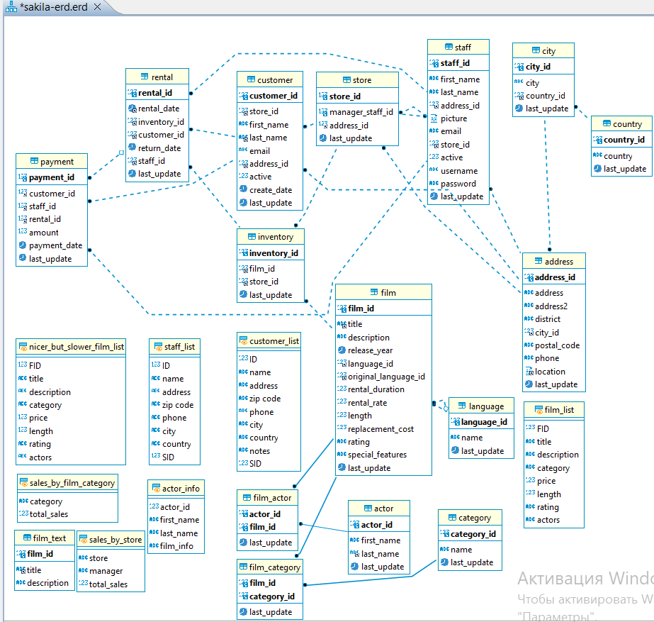

# Домашнее задание к занятию 12.2. «Работа с данными (DDL/DML)» - Гумлевой Александр

## Задание 1
1.1. Поднимите чистый инстанс MySQL версии 8.0+. Можно использовать локальный сервер или контейнер Docker.  
1.2. Создайте учётную запись sys_temp.  
1.3. Выполните запрос на получение списка пользователей в базе данных. (скриншот)  


1.4. Дайте все права для пользователя sys_temp.

1.5. Выполните запрос на получение списка прав для пользователя sys_temp. (скриншот)


1.6. Переподключитесь к базе данных от имени sys_temp.


1.6. По ссылке https://downloads.mysql.com/docs/sakila-db.zip скачайте дамп базы данных.

1.7. Восстановите дамп в базу данных.

1.8. При работе в IDE сформируйте ER-диаграмму получившейся базы данных. При работе в командной строке используйте команду для получения всех таблиц базы данных. (скриншот)




Результатом работы должны быть скриншоты обозначенных заданий, а также простыня со всеми запросами.

<details>
  <summary>Запросы</summary>

```sql
SELECT user FROM mysql.user;
GRANT ALL PRIVILEGES ON *.* TO 'sys_temp'@'%';
SHOW GRANTS FOR 'sys_temp'@'%';
ALTER USER 'sys_temp'@'%' IDENTIFIED WITH mysql_native_password BY '111111';
FLUSH PRIVILEGES;
SELECT user();
show tables from sakila;
```
</details>

## Задание 2
Составьте таблицу, используя любой текстовый редактор или Excel, в которой должно быть два столбца: в первом должны быть названия таблиц восстановленной базы, во втором названия первичных ключей этих таблиц. Пример: (скриншот/текст)

Название таблицы | Название первичного ключа
customer         | customer_id

<details>
  <summary>Результат</summary>

```sql
Название таблицы  |  Название первичного ключа
actor             |  actor_id
address           |  address_id
category          |  category_id
city              |  city_id
country           |  country_id
customer          |  customer_id
film              |  film_id
film_actor        |  actor_id
film_category     |  film_id
film_text         |  film_id
inventory         |  inventory_id
language          |  language_id
payment           |  payment_id
rental            |  rental_id
staff             |  staff_id
store             |  store_id

ЗАПРОСЫ

show full tables from sakila
WHERE table_type = 'BASE TABLE'

SELECT k.COLUMN_NAME
FROM information_schema.table_constraints t
LEFT JOIN information_schema.key_column_usage k
USING(constraint_name,table_schema,table_name)
WHERE t.constraint_type='PRIMARY KEY'
    AND t.table_schema=DATABASE();

```
</details>  
